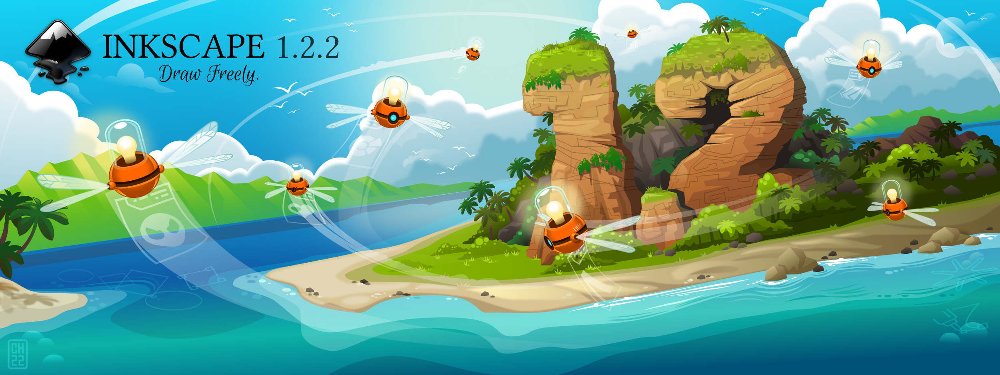
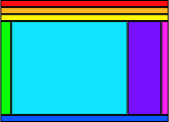
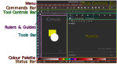
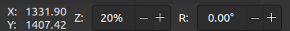

class: 
```{r setup, include=FALSE}
options(htmltools.dir.version = FALSE)
library(xaringanthemer)
```

```{r xaringanExtra, echo=FALSE}
xaringanExtra::use_xaringan_extra(c("tile_view", "animate_css"))
```

# Outline

.pl[
This lesson will be 90 minutes - divided into about a 30 minute interactive outline of how to create posters using InkScape.

Followed by 60 minutes of you working on your posters, with me assisting in answering any questions you have.

We'll speak briefly about designing a poster, before looking at the basics of InkScape and how you can use it effectively.

]

.pr[

.w66[]<br>
.sm[A poster for the Digilego Project]

]

---
# Poster design concepts
.pull-left[
**Planning & preparation**
- Tailor a story for *your audience*
- Requirements, standards, and peers

**Layout & content**
- Clear flow / organization, with breathing space
- Create all the content first
  - Text, images, figures (vector) & spell check!
- Target content to your audience
- Less is more be succinct (brief)
- Determine size of poster
  - Impacts amount of information, and which images may be suitable
]

.pull-right[
**Color Scheme & Fonts**
- Select a consistent set of fonts and colours
  - Limit font types (2 max), sizes (min. ~24pt)
  - Serif fonts are easier to read
- Ease reading: Left justify, no long text lines
- Good contrast - Use faded underlays

**Images & graphics**
- Keep figures in vector format when possible (e.g., SVG, PDF)
- Text in figures needs to be large enough
- Images need to be high resolution to not be pixelated

**Iterate through feedback**
- Try printing a small copy - annotate changes/suggestions.

.sources[[WCU](https://researchguides.wcu.edu/researchposter/home),   [UCD](https://urc.ucdavis.edu/sites/g/files/dgvnsk3561/files/inline-files/General%20Poster%20Design%20Principles%20-%20Handout.pdf)]

]

---

# InkScape - A **vector** graphics editor

.pl[
InkScape is a free and open source vector editor. It's incredibly versatile.


]

.pr[
Equivalent vector graphics editors programs:
- Adobe Illustrator
- CorelDraw

Alternatively, raster graphics editors are the other type of 'drawing' system.
It's most commonly used to edit photographs and for 'painting'.

Raster graphics editor programs:
- GIMP (free)
- Adobe Photoshop
]

---

# Learning objectives

.pull-left[
## Outline
- View, Controls and control modifiers (Shift and Ctrl)
- Shortcuts
- Creating, moving, scaling, and rotating objects
- Layers, Objects, the menus, and controls
- Selection
- Grouping and Ungrouping objects
- Guides
- Resize page to content
- Commonly used Tools & Panels
- Export
- Scaling (edges)
- Fill/stroke order
- Text - add to stroke
- Alignment and distribution
]

.pull-right[


InkScape has many Panels and Toolbars.

Icons may appear different depepending on your theme/icon style.
]

---

# Toolbars, Controls, and Panels

.w90[]

???

You can modify which or where they are visible in the Menu under:
- View -> Show/Hide, and
- View -> Wide Screen

---
# Shortcuts - AKA Use Two Hands!
.pl[
**Shortcuts** make you much more productive:
- Save: .key[Ctrl]-.key[S]
- New canvas/file: .key[Ctrl]-.key[N]
- Cut selection: .key[Ctrl]-.key[X]
- Paste selection: .key[Ctrl]-.key[V]
- Duplicate selection: .key[Ctrl]-.key[D]
- Copy selection: .key[Ctrl]-.key[C]
- Paste selection: .key[Ctrl]-.key[V]
- Undo action: .key[Ctrl]-.key[Z]
- Redo action: .key[Ctrl]-.key[Shift]-.key[Z]
- Toggle selector: .key[Space-bar]

The Status Bar also provides tool shortcuts/controls information.
]

.pull-right[
The **.key[Ctrl], .key[Shift], and .key[Alt]** keys are common **modifiers** in InkScape.

If you are using a tool and thinking *"It would be nice if I could do X!"*, try using one of these modifier keys as it may provide this functionality.

.w75[]

]

---
# View, Controls and control modifiers
.tl[
**Panning**
- Free movement: Press mouse wheel down on Canvas
- Pan up/down: Mouse wheel
- Pan left/right: .key[Shift] + Mouse wheel

**Zooming**
- Zoom-in: .key[Ctrl] + Mouse wheel or just the .key[\+ -] key
- Zoom-out: .key[Ctrl] + Mouse wheel or just the .key[-] key
- Commands Bar: 
- Manually (right side of Status Bar): 
]

---
# Creating objects

.pull-left[
From the Tools Bar, select the Rectangle Tool.

Click and drag your cursor across the Canvas' Page.

.w66[]

In regular mode the shape follows your cursor.

See the Status Bar for moderators of the tool.

Also look at the Tool Controls Bar, where contetual options become available. For the rectangle tool you can set the corner radius.
]

.pull-right[
Now try the same thing holding the .key[Shift] key:
.w66[]

And then the .key[Ctrl] key:
.w66[]  
Now try with both .key[Shift] + .key[Ctrl]. What happens?
]

---
# Moving objects

.pull-left[
From the Tools Bar activate the **Select and transform** tool:  or press .key[S] or .key[F1] to activate it.

Alternatively, press .key[Spacebar] to toggle between another tool and the Select tool. **Very useful!**

Simply click and drag an object to move it.

  
It may snap to a nearby object.  
This can be good or bad.
]

.pull-right[
Now try the same thing holding the .key[Shift] key:
  
Snapping is disabled.

And then the .key[Ctrl] key:
  
The object is locked to the horizontal or vertical.  
Now try with both .key[Shift] + .key[Ctrl]. What happens?

]

---
# Scaling objects

.pull-left[
.fr[]

Using the same **Select and transform** tool   it is possible to scale the object by grabbing the controls that appear when clicking on an object.


Once a scale control, the double edge arrows, is grabbed, modifying the scale or shape of an object behaves **similarly** to the creation of an object.

When grabbing controls and modifing a shape with the .key[Ctrl] it maintains the existing ratio rather than locking to square or other pre-set ratios.
]

.pull-right[

.w66[] Regular - pull
.w66[] .key[Shift] - mirrors
.w66[] .key[Ctrl] - scales
]

---
# Rotating objects

.pull-left[
.fr[]

Clicking on a shape or object twice, but not double clicking, will bring up the rotation and skew controls.

You can rotate the object freely by grabbing the corner controls.
.fl[]

It rotates about the **point of rotation** , which can be adjusted!

<hr>

The edge controls skew the shape, rather than rotate.
]

.pull-right[
A .key[Shift] rotation pivots on the opposite corner.


A .key[Ctrl] rotation locks to 15 degree increments.


]

---
# Layers, Objects, the menus, and controls

.pull-left[
You may have done posters or figures in PowerPoint. There you typically just move things forward, backwards, or to the front or back.

**InkScape gives you much finer control if you want it.**

InkScape uses the Layers and Objects metaphor to organize elements.
You can open the Layer and Objects Panel in the following ways:
- Object -> Objects...
- Layer -> Layers...

It results in the same Panel appearing.

.ts[*InkScape recently merged Layers and Objects into one panel. They were different. The Layer menu grouped objects within layers, while the Objects menu shows the layers and their contained objects. You may encounter this in older versions of InkScape (versions < 1.2).]
]

.pull-right[
You are dealing with a visually hierarchy of layers, Inkscape calls Z-order. 

**Top layers and objects cover the lower ones.**

Moving objects within layers is easy:
- Drag them up/down and into other groups
- Use the Layers and Objects Panel buttons:
 .w100[]
- .key[Home]/.key[End]: Move to front/back
- .key[PgUp]/.key[PgDown]: Move towards front/back

Dragging with the mouse is fine, but using the keyboard is typically faster and easier.
]

---
# Selection 

.pull-left[
To select an object, still using the Selector Tool , you can either:
- Click on it.
- Drag a selection box (called a rubberband selection) completely around it and others.
- .key[Shift] click to add/subtract from your selection.
- .key[Ctrl] + .key[A] Selects all objects in the current layer.
- .key[Alt] allows you to pierce through objects with successive clicks. Hold .key[Alt] to then move the object.


- Right-click on an object also allows, among other things, selection based on fill or stroke.

]

.pull-right[
**Deselection** can be done by:
- Clicking an empty part of the canvas
- Pressing .key[Esc]


## Rubberband selection

Using the rubberband selection can be problematic if you have a a background object. Use .key[Shift] to force the rubberband selection tool, without selecting the object you click on to start it.

]

???

This allows you to move multiple objects together while maintaining their relative arrangement.

This method is fine short term, but there needs to be a better way to maintain relationships more robustly when desired.

**There is.**

---
# Grouping and Ungrouping

.pull-left[
You want to keep some elements together as you build your graphic.
Either you want to keep:
- Their visual order (what's on top of what)
- Their relative position

The best way to maintain relationships is to **group objects**.

Grouping hotkeys:
- Group: .key[Ctrl]+.key[G]
- Ungroup: .key[Ctrl]+.key[U]  or .key[Ctrl]+.key[Shift]+.key[G]

You can also Group/Ungroup using the Commands Bar buttons: 

.w20[]
]

.pull-left[
## 'Moving' within Groups

You can now group elements, but how do you make changes to items within groups without ungrouping them.

**Double clicking** on a group allows you to ***enter*** it, make changes to objects in the group, such as move them independently or change their styling.

**Double clicking** outside of the group to ***exit*** the group.


Note that you can have groups within groups and may need to double-click a few times to reach the level you wish to edit objects at.

]

---
# Guides & Snapping

.pl[
## Guides
Guides can be creating by pulling/dragging from either ruler onto the Canvas.  
These will help you align content.

They can be manually adjusted (double click), labelled, rotated, and deleted with .key[Delete].

These are only useful however if **snapping** is enabled.
]

.pr[
## Snapping

The Snap Control Bar is in the top right corner. Opening it allows you to select exactly what kinds of snaps you want to allow (e.g., edges, nodes, mid-points, etc...).

  

]

---
# Pages

.pull-left[
At the bottom of the Tools Bar is the Page creation and editing tool.

It allows you to:
- Create a new page by clicking on the canvas and dragging a rectangle.
- Manually resize existing pages.
- Select a pre-set page size from the Tool Controls Bar.


With the Page Tool Control Bar you can:
- Reorder pages
- Set the page size
- Set the pages size to the content size
]

.pr[
## Exporting
Each page can be individually exported as an image.
You can select your page to export from the Status Bar.

When exporting to **PDF** they works as expected, as separate pages.

See the Export section a few pages later.
]

---
# Common Tools and Panels

.pull-left[
## Common Tools


<ol style="margin-left: 2em">
<li> Select & Transform (S)</li>
<li> Edit Paths by nodes (N)</li>
<li> Create Rectangle (R)</li>
<li> Create Circle, Ellipses, & Arcs (E)</li>
<li> Beziers and Straight lines (B)</li>
<li> Text (T)</li>
<li> Dropper (D)</li>
<li> Pages</li>
</ol>
]

.pull-right[
## Common Panels
Most of these can be enabled by the Object Menu.

.fr[Fill & Stroke: .key[Shift] + .key[Ctrl] + .key[F]]
.fr[Layers & Objects:.key[Shift] + .key[Ctrl] + .key[L]]
.fr[Align & Distribute: .key[Shift] + .key[Ctrl] + .key[A]]
.fr[Transform: .key[Shift] + .key[Ctrl] + .key[M]]
.fr[Export: .key[Shift] + .key[Ctrl] + .key[E]]

.w100[<hr>]

So holding .key[Shift] + .key[Ctrl] and typing:

.key[F].key[L].key[A].key[M].key[E]

Opens commonly used panels.

]

---
# Fill & Stroke

.pl[
The fill and outline colour, as well as stroke thickness and style, provide most of the styling needed to make a figure, graph, map, or poster.

You may occasionally use the Fill and Stroke paint sub-tabs, but try not to. It's more efficient to either use the Colour Palette to set the fill by clicking or Stroke by .key[Shift] clicking.

Additionally, the dropper tool can copy colour from other objects in the canvas. It also allows using .key[Shift] to set the Stroke.

]

.pr[
.w80[]

]

---
# Exporting and Saving

.pull-left[
## Exporting to PDF
From the Menu:
- File -> Save a Copy...

## Saving to SVG

Once happy with your poster, export it to PDF or whatever format needed by the printer or journal.   

You will need the SVG file if you wish to makes changes in the future so **always keep an SVG copy as the good source**.

It is possible to open a **PDF** file in Inkscape, but, likely, all text will be converted to **shapes**, no longer editable.

]

.pull-right[
## Exporting to PNG (or other)
Open the Export Panel with:
- Menu: File -> Export...
- Shortcut: .key[Shift] + .key[Ctrl] + .key[E]


You can select the page you wish to export from the Status Bar.
]


---
# Creating a Poster
.pl[
You now have more than enough skills to make a poster.

Start by creating a Page of the size of your poster (e.g. A3, A2, etc...), or flyer (e.g., A5, A6).

You should already have the content ready, and perhaps some photographs, graphs or designs in mind.
]

.pr[
## Making a Good Poster
The best method to make a good poster is to get as much feedback from others as possible.

]

---
# Closing

.pl[
## InkScape Resources
There are many many resources:
- [Inkscape](https://inkscape.org/learn/)
- Google for help
- Tutorials on YouTube

## Sources
- [Inkscape tutorial: Basic](https://inkscape.org/doc/tutorials/basic/tutorial-basic.html)
- [Inkscape shortcuts](https://inkscape.org/doc/keys.html)
]

.pull-right[
## Funding


The creation of this resources has been (partially) funded by the ERASMUS+ grant program of the European Union under grant no. 2020 1 DE01 KA226 005814. Neither the European Commission nor the project's national funding agency DAAD are responsible for the content or liable for any losses or damage resulting from the use of these resources.


]