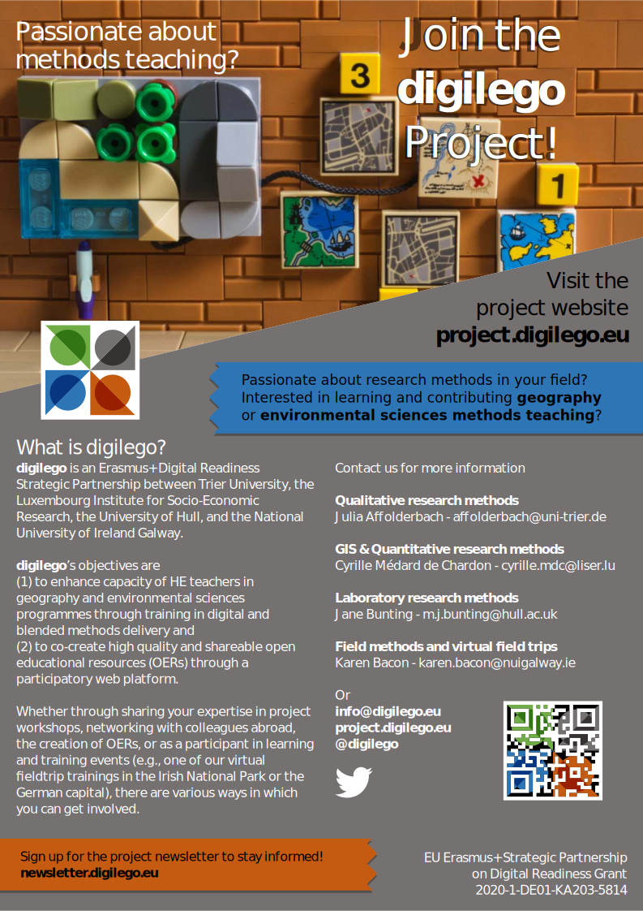

class: 
```{r setup, include=FALSE}
options(htmltools.dir.version = FALSE)
library(xaringanthemer)
```

```{r xaringanExtra, echo=FALSE}
xaringanExtra::use_xaringan_extra(c("tile_view", "animate_css"))
```

# Outline

.pl[
This lesson will be 90 minutes - divided into about a 30 minute interactive outline of how to create posters using InkScape.

Followed by 60 minutes of you working on your posters, with me assisting in answering any questions you have.

We'll speak briefly about designing a poster, before looking at the basics of InkScape and how you can use it effectively.

]

.pr[

.w66[]<br>
.sm[A poster for the Digilego Project]

]

---
# Poster design concepts
.pull-left[
**Planning & preparation**
- Tailor a story for *your audience*
- Requirements, standards, and peers

**Layout & content**
- Clear flow / organization, with breathing space
- Create all the content first
  - Text, images, figures (vector) & spell check!
- Target content to your audience
- Less is more be succinct (brief)
- Determine size of poster
  - Impacts amount of information, and which images may be suitable
]

.pull-right[
**Color Scheme & Fonts**
- Select a consistent set of fonts and colours
  - Limit font types (2 max), sizes (min. ~24pt)
  - Serif fonts are easier to read
- Ease reading: Left justify, no long text lines
- Good contrast - Use faded underlays

**Images & graphics**
- Keep figures in vector format when possible (e.g., SVG, PDF)
- Text in figures needs to be large enough
- Images need to be high resolution to not be pixelated

**Iterate through feedback**
- Try printing a small copy - annotate changes/suggestions.

.sources[[WCU](https://researchguides.wcu.edu/researchposter/home),   [UCD](https://urc.ucdavis.edu/sites/g/files/dgvnsk3561/files/inline-files/General%20Poster%20Design%20Principles%20-%20Handout.pdf)]

]

---

# InkScape - A **vector** graphics editor

.pl[
InkScape is a free and open source vector editor. It's incredibly versatile.


]

.pr[
Equivalent vector graphics editors programs:
- Adobe Illustrator
- CorelDraw

Alternatively, raster graphics editors are the other type of 'drawing' system.
It's most commonly used to edit photographs and for 'painting'.

Raster graphics editor programs:
- GIMP (free)
- Adobe Photoshop
]

---

# Learning objectives

.pl[
## Outline
- View, Controls and control modifiers (Shift and Ctrl)
- Layers, Objects, the menus, and controls
- Grouping and ungrouping
- Selection
- Hot keys
- Guides
- Resize page to content
- Export
- Scaling (edges)
- Fill/stroke order
- Text - add to stroke
- Alignment and distribution
]

.pr[

InkScape has many panels and toolbars.

]

---
# Use two hands!
.pl[
**Shortcuts** make you much more productive:
- Save: Ctrl-S
- New canvas/file: Ctrl-N
- Cut selection: Ctrl-X
- Paste selection: Ctrl-V
- Duplicate selection: Ctrl-D
- Copy selection: Ctrl-C
- Copy selection: Ctrl-C
- Undo action: Ctrl-Z
- Redo the undone action: Ctrl-Shift-Z
- Space-bar: Switch to selector (and back)
]

.pr[
The **Ctrl, Shift, and Alt** keys are common modifiers.

If you are using a command, try using one of these modifiers as it may provide some helpful functionality.


Two devices? Use two hands!
]

---
# View, Controls and control modifiers
.pl[
**View: Panning, zooming**
- Zoom-in: .key[Ctrl] + Mouse wheel or .key[+/=] key
- Zoom-out: .key[Ctrl] + Mouse wheel or .key[-] key
- Pan up/down: Mouse wheel
- Pan left/right: .key[Shift] + Mouse wheel
- Manually (bottom right of screen):

]


---
# Layers, Objects, the menus, and controls

.pl[
You may have done posters or figures in PowerPoint. There you typically just move things forward, backwards, or to the front or back. InkScape gives you much finer control if you want it.

There are **two** ways of viewing and organizing your objects beyond the canvas.
- The Objects menu (Object -> Objects...)
- The Layers menu (Layer -> Layers...)

The Layer menu groups objects within layers, while the Objects menu shows the layers and their contents.

**The Groups menu is much better for organizing your content.**
]

.pr[
Regardless of which menu you use, you are dealing with a visually hierarchy that we will call 'layers'.

Moving objects within layers (in either the Layers or Objects menus) is easy:
- Home: Move to front
- End: Move to back
- Page Up: Move towards front
- Page Down: Move towards back

You can of course use the mouse as well, but using the keyboard is typically faster.
]

---
# Grouping and Ungrouping

.pl[
You want to keep elements together as you build them. The best way to maintain their positional relationships is to group them.
]
.pr[
Grouping hotkeys:
- Group: .key[Ctrl]+.key[G]
- Ungroup: .key[Ctrl]+.key[U]
]

---
# Closing

.pl[
**Poster**
The best method of having a good poster is to get as much feedback from others as possible.

**InkScape**
There are many many resources - remember to Google for help.

]

.pr[
Sources:
- [Inkscape tutorial: Basic](https://inkscape.org/doc/tutorials/basic/tutorial-basic.html)
]